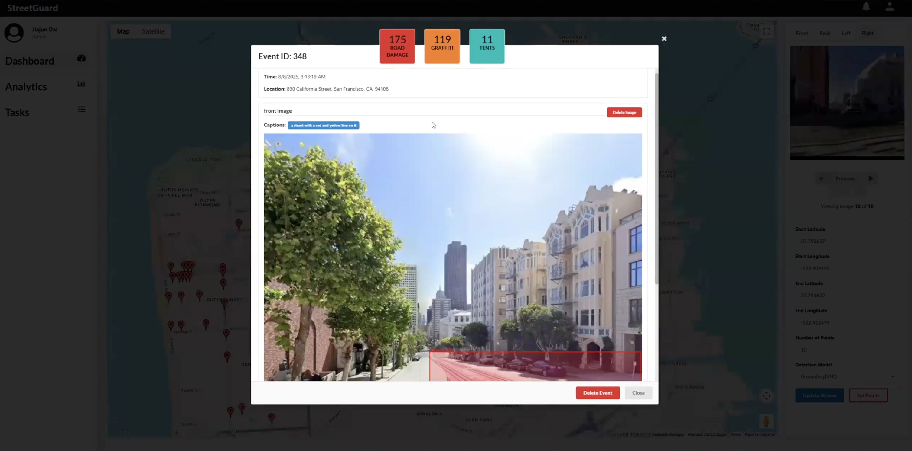
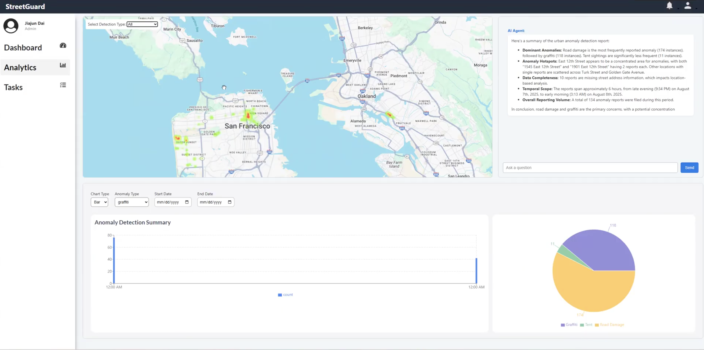
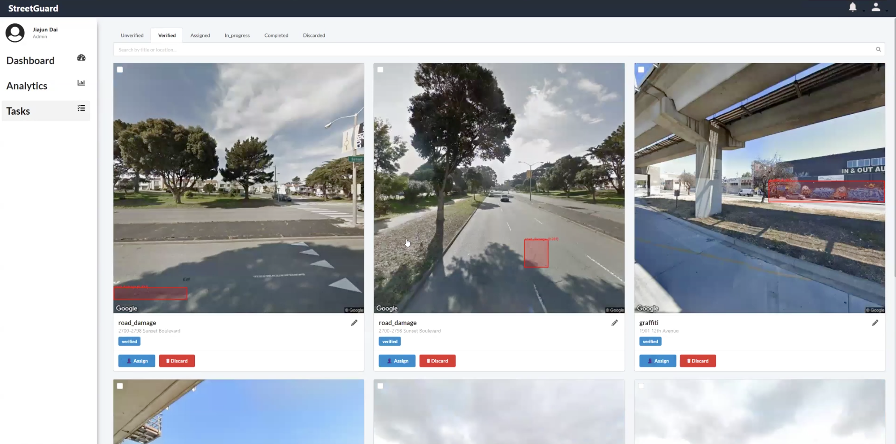
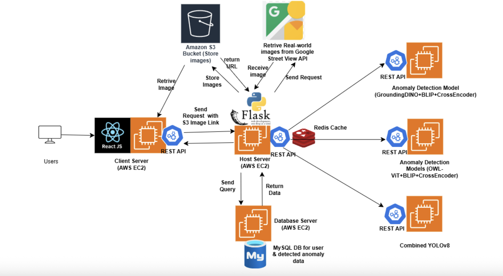
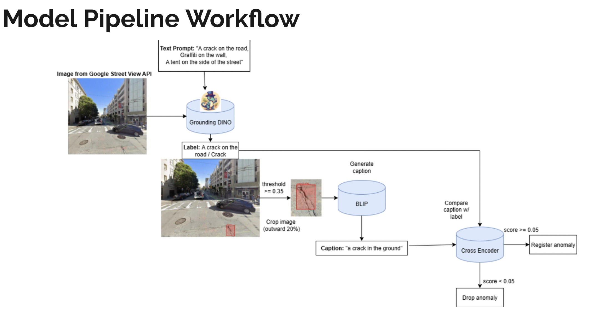
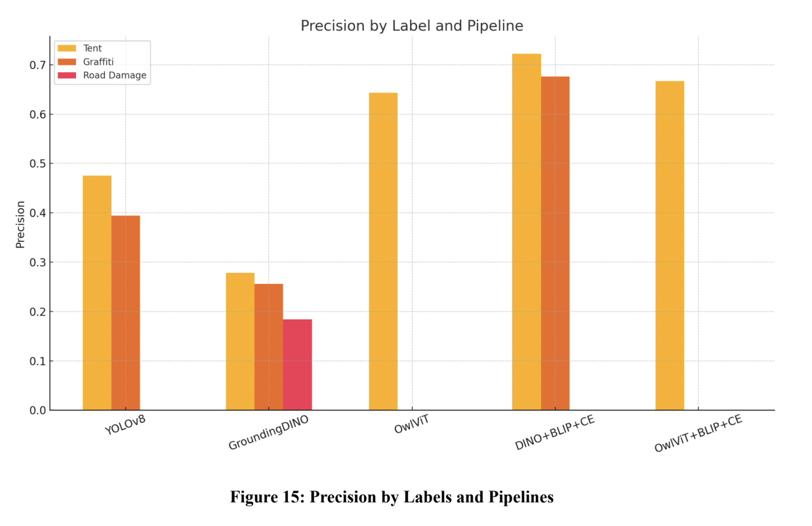
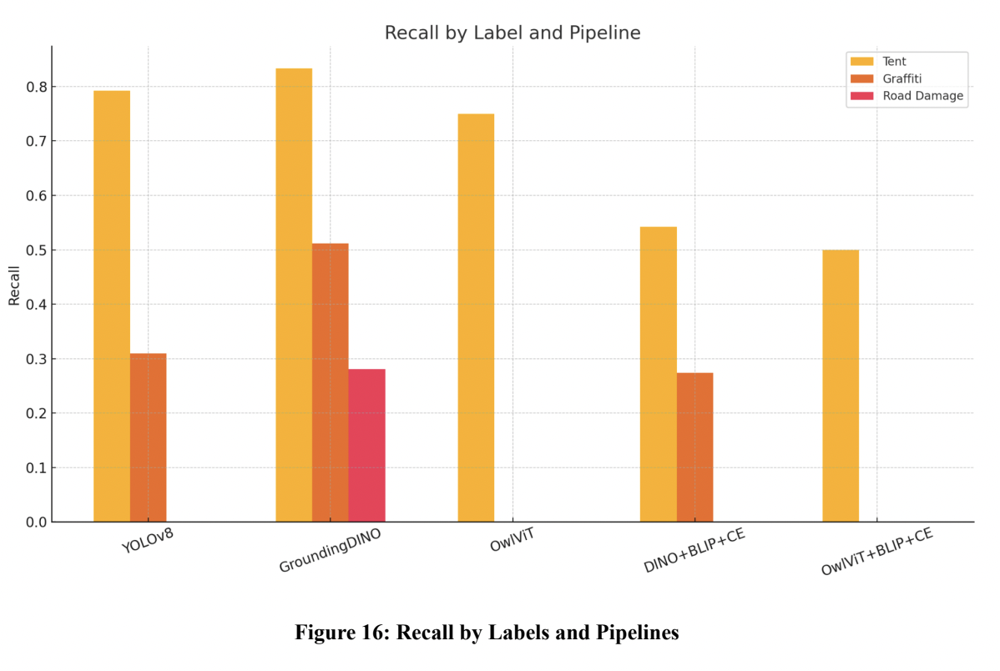
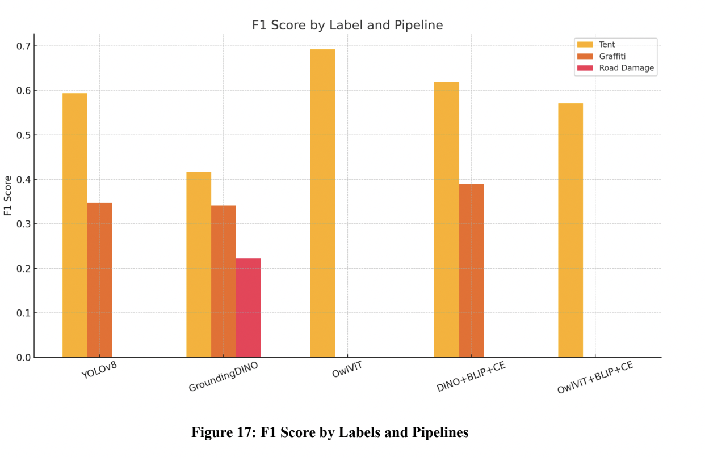

# StreetGuard: AI-Powered Urban Maintenance Monitoring System

[](https://www.python.org/downloads/)
[](https://reactjs.org/)
[](https://flask.palletsprojects.com/)
[](LICENSE)

> **Urban Maintenance Reporting and Monitoring System Utilizing Zero-Shot Learning Models and Vehicle Cameras**

## 📋 Table of Contents

- [Overview](#overview)
- [Key Features](#key-features)
- [System Architecture](#system-architecture)
- [Technology Stack](#technology-stack)
- [Installation & Setup](#installation--setup)
- [Usage](#usage)
- [API Documentation](#api-documentation)
- [Performance Metrics](#performance-metrics)
- [Deployment](#deployment)
- [Contributing](#contributing)
- [License](#license)

## 🎯 Overview

StreetGuard is an advanced AI-powered urban maintenance monitoring system that leverages cutting-edge computer vision and zero-shot learning models to autonomously detect and report urban infrastructure issues in real-time. The system addresses critical challenges in modern urban maintenance by providing automated, data-driven insights for city officials to prioritize repairs and allocate resources efficiently.

### Problem Statement

Urban infrastructure maintenance faces persistent challenges:

- **Road Safety Hazards**: Potholes, road damage, and traffic obstructions
- **Public Safety Issues**: Illegal encampments and vandalism
- **Resource Inefficiency**: Traditional manual inspection methods are slow and labor-intensive
- **Lack of Real-time Data**: Delayed response times due to insufficient monitoring

### Solution Approach

StreetGuard introduces a novel hybrid detection pipeline combining:

- **Open-Set Models**: GroundingDINO and OWL-ViT for zero-shot anomaly detection
- **Specialized Models**: Fine-tuned YOLOv8 for high-speed, high-accuracy detection
- **Real-time Processing**: Vehicle-mounted camera simulation via Google Street View API
- **Intelligent Analytics**: LLM-powered insights and predictive maintenance recommendations

## ✨ Key Features

### 🔍 **Multi-Model Detection Pipeline**

- **GroundingDINO + BLIP + CrossEncoder**: Zero-shot detection with semantic validation
- **OWL-ViT + BLIP + CrossEncoder**: Alternative open-vocabulary detection approach
- **YOLOv8 Specialized Models**: High-speed detection for road damage, graffiti, and encampments

### 🗺️ **Interactive Visualization**

- Real-time Google Maps integration with custom markers
- Dynamic heatmaps showing anomaly density across urban areas
- Live streaming simulation with multi-directional camera views
- Comprehensive analytics dashboard with charts and trend analysis

### 🤖 **AI-Powered Intelligence**

- Google Gemini LLM integration for automated report generation
- Natural language query interface for anomaly analysis
- Predictive analytics for maintenance prioritization
- Semantic understanding of urban maintenance contexts

### 📊 **Comprehensive Analytics**

- Real-time detection event tracking
- Historical trend analysis and reporting
- Task assignment and progress monitoring
- Performance metrics and system health monitoring

## 📸 Demo Images

### **Dashboard**
  
*Interactive map with markers and live stream window.*

### **Anomaly Page**
  
*Detection events with detailed anomaly information.*

### **Analytics**
  
*LLM chatbot assistant, heatmap visualization, and analytics graphs.*

### **Task Management**
  
*Task assigning, tracking, and completion workflow.*


## ​ Demo Video

Watch a quick demo showcasing **StreetGuard** in action:

[](https://drive.google.com/file/d/1bS_jNG-ncj8WxWTqgNd1MBV1Yk-XTiQc/view?usp=drive_link)

> Note: Clicking the badge will open the demo video in Google Drive.

## 🏗️ System Architecture



## 🔄 Model Pipeline Workflow



Our detection workflow combines multiple AI models in a hybrid pipeline to balance flexibility, precision, and speed. The process begins with **GroundingDINO or OWL-ViT**, which perform zero-shot anomaly detection using natural language prompts. Detected regions are then passed to **BLIP**, which generates captions, and a **CrossEncoder** validates the semantic alignment between the caption and the target label. This semantic filtering step significantly reduces false positives by discarding ambiguous detections. In parallel, specialized **YOLOv8 models** handle common recurring issues such as graffiti, road damage, and encampments, providing high-speed and accurate results. Together, this workflow ensures reliable detection of both known and novel hazards, enabling real-time and scalable urban maintenance monitoring:contentReference[oaicite:0]{index=0}.


## 📊 Model Performance

### Precision Comparison


### Recall Comparison


### F1 Score Comparison


Our evaluation shows that the **open-set hybrid pipeline (GroundingDINO + BLIP + CrossEncoder)** consistently outperforms standalone models and the YOLOv8 baseline in terms of precision and balanced effectiveness. By adding a semantic validation layer, the pipeline dramatically reduces false positives—achieving precision of ~0.72 for tents and ~0.68 for graffiti—while still maintaining competitive F1 scores. Although recall drops due to stricter filtering, the overall reliability and consistency of this hybrid approach make it more practical for real-world deployment, where accurate and trustworthy alerts are critical for municipal operations.


## 🛠️ Technology Stack

### **Frontend Technologies**

- **React.js 18+**: Modern component-based UI framework
- **Google Maps API**: Interactive mapping and visualization
- **Socket.IO Client**: Real-time communication
- **Recharts**: Data visualization and analytics
- **Framer Motion**: Smooth animations and transitions

### **Backend Technologies**

- **Python 3.8+**: Core application logic
- **Flask 2.0+**: RESTful API framework
- **Flask-SocketIO**: Real-time bidirectional communication
- **SQLAlchemy**: Database ORM and management
- **Google Gemini API**: Large language model integration

### **AI/ML Models**

- **GroundingDINO**: Zero-shot object detection
- **OWL-ViT**: Open-vocabulary object detection
- **YOLOv8**: Specialized anomaly detection models
- **BLIP**: Image captioning and understanding
- **CrossEncoder**: Semantic alignment validation

### **Infrastructure & Storage**

- **AWS EC2**: Scalable cloud computing
- **AWS S3**: Object storage for images and data
- **MySQL**: Relational database management
- **Redis**: High-performance caching layer
- **Docker**: Containerization and deployment

## 🚀 Installation & Setup

### Prerequisites

- **Python 3.8+**
- **Node.js 16+**
- **MySQL 8.0+**
- **Redis 6.0+**
- **Google Cloud Platform Account** (for Street View API)
- **AWS Account** (for S3 and EC2 deployment)

### Backend Setup

1. **Clone the repository**

   ```bash
   git clone https://github.com/your-username/CMPE295-Autonomous-Detection.git
   cd CMPE295-Autonomous-Detection/backend
   ```

2. **Create virtual environment**

   ```bash
   python -m venv venv

   # Windows
   venv\Scripts\activate

   # macOS/Linux
   source venv/bin/activate
   ```

3. **Install dependencies**

   ```bash
   pip install -r requirements.txt
   ```

4. **Configure environment variables**

   ```bash
   cp .env.example .env
   # Edit .env with your configuration
   ```

5. **Initialize database**

   ```bash
   python -c "from app import db; db.create_all()"
   ```

6. **Start the backend server**
   ```bash
   python app.py
   ```

### Frontend Setup

1. **Navigate to frontend directory**

   ```bash
   cd ../frontend
   ```

2. **Install dependencies**

   ```bash
   npm install
   ```

3. **Configure environment variables**

   ```bash
   cp .env.example .env
   # Edit .env with your API keys and configuration
   ```

4. **Start development server**
   ```bash
   npm start
   ```

## 📖 Usage

### **System Access**

- **URL**: `http://localhost:3000` (Frontend)
- **API Base**: `http://localhost:5000/api` (Backend)
- **Admin Panel**: Available for authorized users with administrative privileges

### **Core Workflows**

#### 1. **Anomaly Detection Pipeline**

```python
# Example: Start detection stream
POST /api/stream/start
{
  "start_coords": {"lat": 37.7749, "lng": -122.4194},
  "end_coords": {"lat": 37.7849, "lng": -122.4094},
  "model": "grounding_dino",
  "detection_types": ["graffiti", "road_damage", "tent"]
}
```

#### 2. **Real-time Monitoring**

- **Live Stream**: Monitor real-time detection results
- **Interactive Map**: View detected anomalies with detailed information
- **Heatmap**: Visualize anomaly density across urban areas

#### 3. **Analytics & Reporting**

- **Dashboard**: Comprehensive overview of system performance
- **Charts**: Trend analysis and statistical insights
- **LLM Reports**: AI-generated summaries and recommendations

## 📚 API Documentation

StreetGuard provides a comprehensive RESTful API for urban anomaly detection, task management, and analytics. All endpoints are prefixed with `/api` unless otherwise specified.

### **Authentication & User Management**

| Endpoint        | Method | Description         | Request Body                                                                             | Response                                                                                                                                          |
| --------------- | ------ | ------------------- | ---------------------------------------------------------------------------------------- | ------------------------------------------------------------------------------------------------------------------------------------------------- |
| `/auth/signup/` | POST   | User registration   | `{"email": "string", "password": "string", "firstname": "string", "lastname": "string"}` | `{"message": "Signup successful"}`                                                                                                                |
| `/auth/login/`  | POST   | User authentication | `{"email": "string", "password": "string"}`                                              | `{"id": int, "message": "Login successful", "email": "string", "firstname": "string", "lastname": "string", "role": "string", "token": "string"}` |

### **Anomaly Detection & Mapping**

| Endpoint                            | Method | Description                                 | Query Parameters     | Response                                                |
| ----------------------------------- | ------ | ------------------------------------------- | -------------------- | ------------------------------------------------------- |
| `/anomalies`                        | GET    | Retrieve all detection events with metadata | None                 | Array of events with nested images and metadata         |
| `/anomalies/<event_id>`             | DELETE | Delete specific detection event             | `event_id` (path)    | `{"message": "Event and its related tasks deleted"}`    |
| `/anomalies/images/<image_id>`      | DELETE | Delete specific detection image             | `image_id` (path)    | `{"message": "Image and its related tasks deleted"}`    |
| `/anomalies/metadata/<metadata_id>` | DELETE | Delete specific detection metadata          | `metadata_id` (path) | `{"message": "Metadata and its related tasks deleted"}` |
| `/anomalies/stats`                  | GET    | Get anomaly type statistics                 | None                 | `{"road_damage": int, "graffiti": int, "tent": int}`    |

### **Heatmap & Visualization**

| Endpoint        | Method | Description                        | Query Parameters                                     | Response                                                                 |
| --------------- | ------ | ---------------------------------- | ---------------------------------------------------- | ------------------------------------------------------------------------ |
| `/heatmap/data` | GET    | Get heatmap data for visualization | `type` (optional): `graffiti`, `tent`, `road damage` | Array of `{"lat": float, "lng": float, "weight": int, "type": "string"}` |

### **Analytics & Charts**

| Endpoint      | Method | Description                | Query Parameters                                           | Response                                    |
| ------------- | ------ | -------------------------- | ---------------------------------------------------------- | ------------------------------------------- |
| `/chart-data` | GET    | Get time-series chart data | `type`: anomaly type, `start`: start date, `end`: end date | Array of `{"date": "string", "count": int}` |

### **AI-Powered Intelligence (LLM)**

| Endpoint         | Method | Description                          | Request Body                                 | Response              |
| ---------------- | ------ | ------------------------------------ | -------------------------------------------- | --------------------- |
| `/llm-query`     | POST   | AI-powered data analysis             | `{"context": "string", "message": "string"}` | `{"reply": "string"}` |
| `/llm-summarize` | POST   | Generate automated anomaly summaries | None                                         | `{"reply": "string"}` |

### **Staff Task Management**

| Endpoint                 | Method | Description                | Query Parameters                                           | Request Body                             | Response                                                                           |
| ------------------------ | ------ | -------------------------- | ---------------------------------------------------------- | ---------------------------------------- | ---------------------------------------------------------------------------------- |
| `/tasks`                 | GET    | Get paginated task list    | `page`, `per_page`, `status`, `worker_id`, `sort`, `order` | None                                     | Paginated tasks with metadata                                                      |
| `/tasks/<task_id>`       | PUT    | Update specific task       | `task_id` (path)                                           | `{"status": "string", "worker_id": int}` | `{"message": "Task updated successfully", "task_id": int}`                         |
| `/tasks/bulk`            | PUT    | Bulk update multiple tasks | None                                                       | Array of task updates                    | Array of update results                                                            |
| `/tasks/getWorkers`      | GET    | Get available workers      | None                                                       | None                                     | Array of worker objects                                                            |
| `/tasks/<task_id>/label` | PUT    | Update task label          | `task_id` (path)                                           | `{"label": "string"}`                    | `{"message": "Label updated successfully", "task_id": int, "new_label": "string"}` |

### **Worker Task Management**

| Endpoint            | Method | Description                  | Query Parameters | Request Body                          | Response                   |
| ------------------- | ------ | ---------------------------- | ---------------- | ------------------------------------- | -------------------------- |
| `/getAssignedTasks` | GET    | Get tasks assigned to worker | `user_id`        | None                                  | Array of assigned tasks    |
| `/startTasks`       | POST   | Mark tasks as in progress    | None             | `{"task_ids": [int], "user_id": int}` | Summary of updated tasks   |
| `/completeTasks`    | POST   | Mark tasks as completed      | None             | `{"task_ids": [int], "user_id": int}` | Summary of completed tasks |

### **Real-Time Communication (Socket.IO)**

| Event          | Direction       | Description                 | Data Payload                                                                                                                                        | Response                                             |
| -------------- | --------------- | --------------------------- | --------------------------------------------------------------------------------------------------------------------------------------------------- | ---------------------------------------------------- |
| `start_stream` | Client → Server | Initialize detection stream | `{"userId": int, "startLatInput": float, "startLngInput": float, "endLatInput": float, "endLngInput": float, "num_points": int, "model": "string"}` | Stream of detection results with images and metadata |

### **Response Status Codes**

| Code | Description           |
| ---- | --------------------- |
| 200  | Success               |
| 201  | Created               |
| 400  | Bad Request           |
| 401  | Unauthorized          |
| 404  | Not Found             |
| 409  | Conflict              |
| 500  | Internal Server Error |

### **Data Models**

#### **Detection Event**

```json
{
  "id": "int",
  "latitude": "string",
  "longitude": "string",
  "timestamp": "ISO 8601 string",
  "street": "string",
  "city": "string",
  "state": "string",
  "zipcode": "string",
  "images": ["DetectionImage"]
}
```

#### **Detection Image**

```json
{
  "id": "int",
  "direction": "string (front|back|left|right)",
  "image_url": "string (S3 URL)",
  "metadatas": ["DetectionMetadata"]
}
```

#### **Detection Metadata**

```json
{
  "id": "int",
  "X1_loc": "float",
  "Y1_loc": "float",
  "X2_loc": "float",
  "Y2_loc": "float",
  "label": "string",
  "score": "float",
  "type": "string (graffiti|tent|road_damage)",
  "caption": "string"
}
```

#### **Task**

```json
{
  "task_id": "int",
  "status": "string (created|assigned|in_progress|completed)",
  "worker_id": "int",
  "notes": "string",
  "scheduled_time": "ISO 8601 string",
  "created_at": "ISO 8601 string",
  "updated_at": "ISO 8601 string"
}
```

### **Query Parameters Reference**

#### **Pagination**

- `page`: Page number (default: 1)
- `per_page`: Items per page (default: 10)

#### **Filtering**

- `status`: Task status filter
- `worker_id`: Filter by assigned worker
- `type`: Anomaly type filter for heatmaps

#### **Sorting**

- `sort`: Sort field (`created_at`, `updated_at`, `scheduled_time`)
- `order`: Sort order (`asc` or `desc`)

### **Rate Limiting & Authentication**

- **Authentication**: JWT tokens required for protected endpoints
- **Token Expiry**: 24 hours from issuance
- **Rate Limiting**: Currently no rate limiting implemented
- **CORS**: Enabled for cross-origin requests

For complete API documentation and examples, see [API_REFERENCE.md](docs/API_REFERENCE.md)

## 📊 Performance Metrics

### **Model Performance Comparison**

| Model         | Precision | Recall | F1-Score | Inference Time |
| ------------- | --------- | ------ | -------- | -------------- |
| YOLOv8        | 0.47      | 0.78   | 0.49     | 0.055s         |
| GroundingDINO | 0.10      | 0.83   | 0.30     | 0.551s         |
| OWL-ViT       | 0.12      | 0.75   | 0.42     | 0.157s         |

### **System Performance**

- **Throughput**: Up to 18.06 images/second (YOLOv8)
- **Latency**: 0.055s end-to-end processing (YOLOv8)
- **Accuracy**: 85%+ for trained anomaly categories
- **Scalability**: Supports concurrent processing of multiple detection streams

## 🚀 Deployment

### **AWS EC2 Deployment**

1. **Launch EC2 Instances**

   - **Frontend**: t3.large (React application)
   - **Backend**: g5.xlarge (Flask + AI models)
   - **Database**: t3.micro (MySQL)

2. **Configure Security Groups**

   - Allow HTTP/HTTPS traffic
   - Configure database access rules
   - Set up VPC for internal communication

3. **Deploy Application**

   ```bash
   # Backend deployment
   git clone <repository>
   pip install -r requirements.txt
   gunicorn -w 4 -b 0.0.0.0:5000 app:app

   # Frontend deployment
   npm run build
   serve -s build -l 3000
   ```

### **Docker Deployment**

```bash
# Build and run with Docker Compose
docker-compose up -d
```

## 🤝 Contributing

We welcome contributions to improve StreetGuard! Please see our [Contributing Guidelines](CONTRIBUTING.md) for details.

### **Development Setup**

1. Fork the repository
2. Create a feature branch (`git checkout -b feature/amazing-feature`)
3. Commit your changes (`git commit -m 'Add amazing feature'`)
4. Push to the branch (`git push origin feature/amazing-feature`)
5. Open a Pull Request

### **Code Standards**

- Follow PEP 8 for Python code
- Use ESLint for JavaScript/React code
- Write comprehensive tests for new features
- Update documentation for API changes

## 📄 License

This project is licensed under the MIT License - see the [LICENSE](LICENSE) file for details.

## 👥 Team

**CMPE 295 - Autonomous Detection Project Team**

- **Haoming Chen** - AI/ML Pipeline Development
- **Jiajun Dai** - Backend Architecture & API Development
- **Rachel Fan** - Frontend Development & UI/UX
- **Vinh Tran** - System Integration & Deployment

**Project Advisor**: Professor Kaikai Liu, San Jose State University

## 📞 Support

- **Documentation**: [Wiki](https://github.com/your-username/CMPE295-Autonomous-Detection/wiki)
- **Issues**: [GitHub Issues](https://github.com/your-username/CMPE295-Autonomous-Detection/issues)
- **Email**: [project-email@example.com](mailto:project-email@example.com)

## 🙏 Acknowledgments

Special thanks to:

- **San Jose State University** for academic support
- **Google Cloud Platform** for Street View API access
- **Hugging Face** for pre-trained AI models
- **Open Source Community** for foundational technologies

---

**StreetGuard** - Transforming urban maintenance through intelligent automation and real-time monitoring.

_Built with ❤️ by the CMPE 295 team at San Jose State University_
